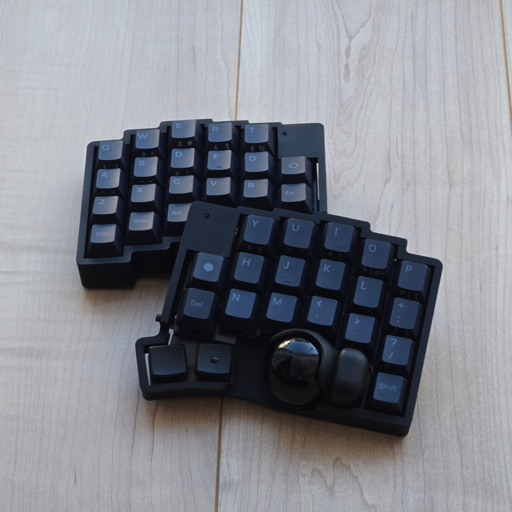

# roBa
roBaは[keyball](https://github.com/Yowkees/keyball/)に影響を受けたワイヤレスキーボードです  

特徴:
+ bluetooth(BLE)対応
+ 分割カラムスタッガード配列(キー数:42)
+ トラックボール搭載
+ 水平ロータリーエンコーダ(EVQWGD001)搭載

## Whare to Buy

メルカリにて組み立てキットが購入可能

## Build Guide

[ビルドガイド（公式）はこちら](https://github.com/kumamuk-git/roBa/blob/main/doc/buildguide.md)

[rk mod v1 を購入のかたはこちら](https://github.com/rk2kk/roBa-rk-mod-main/blob/main/doc/buildguide_v1.md)

[rk mod v2 を購入のかたはこちら](https://github.com/rk2kk/roBa-rk-mod-main/blob/main/doc/buildguide_v2.md)

## Firmware

[ファームウェアのリポジトリはこちら](https://github.com/kumamuk-git/zmk-config-roBa)  
デフォルトでは以下のように設定されています。
+ オートマウスレイヤー：4
+ スクロールレイヤー：5  
+ CPI：400

[ファームウェア、キーマップの編集手順はこちら](https://github.com/kumamuk-git/roBa/blob/main/doc/buildguide.md#6%E3%82%AD%E3%83%BC%E3%83%9E%E3%83%83%E3%83%97%E3%81%AE%E7%B7%A8%E9%9B%86)

